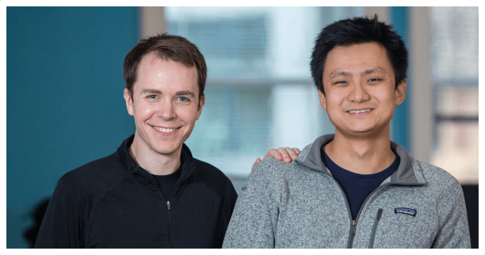

## Master Plan 
We believe code intelligence can help bring the future sooner. Our long-term vision is to make it so everyone, in every community, in every country, and in every industry can create products using the best technology. Here is what we are working on now to help this happen:

* Make basic code intelligence ubiquitous
* Make code review continuous and intelligent
* Increase the amount and quality of open-source code

Read more at [sourcegraph.com/plan](/plan).

## Values
  

#people come first. Together we are advancing technology. We will attract, hire and retain the best teammates in the world and treat everyone in a first-class manner.

#journey is the collection of moments, experiences, and memories that the team shares as we make #progress: the light moments, the laughter, the team coming together to solve a problem, etc.

#progress is the continuous march toward achieving our mission as a team: the milestones, the successes, the breakthroughs, etc.

## Founders 

**Quinn Slack, CEO**
Quinn Slack is CEO and co-founder of Sourcegraph. Prior to Sourcegraph, Quinn co-founded Blend Labs, an enterprise technology company with over 100 employees dedicated to improving home lending. At Palantir Technologies he created a technology platform to help two of the top five U.S. banks recover from the housing crisis. He was the first employee and developer at Bleacher Report after graduating from high school. Quinn graduated with a BS in Computer Science from Stanford.

**Beyang Liu, CTO** 
Beyang Liu is CTO and co-founder of Sourcegraph. Prior to Sourcegraph, Beyang was a software engineer at Palantir Technologies where he developed new data analysis software on a small, customer-facing team working with Fortune 500 companies. Beyang studied Computer Science at Stanford, where he published research in probabilistic graphical models and computer vision at the Stanford AI Lab and thoroughly enjoyed his compilers course.

## Investors

## Board of Directors 

- Scott Raney, Redpoint Ventures
- Daniel Friedland, Goldcrest Capital
- Quinn Slack, Sourcegraph
- Beyang Liu, Sourcegraph

## Advisors and Supporters 

* Adam Ross, Goldcrest Capital
* Bear Douglas, Developer Evangelist
* Jens Pillgram-Larsen, LinkedIn
* James Waldrop, Fitbit
* Mark Striebeck, Google
* Audrey Maclean, Entrepreneur
* Bill Malloy, Technologist & Financier
* John Vrionis, Lightspeed Venture Partners
* Kevin Mahaffey, Lookout
* Peter Hubert, Lux Capital
